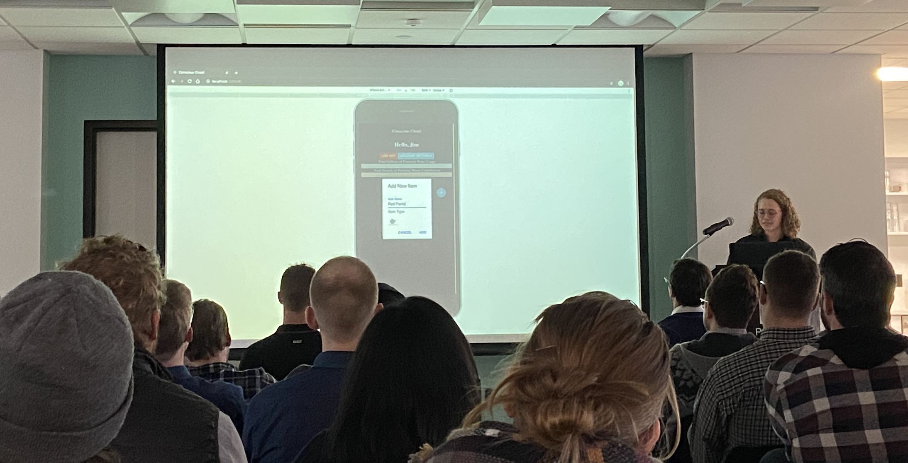

# Conscious Closet
Courtney Olesee's solo project for Prime Digital Academy

Duration: 2 week sprint
- Organizing daily/weekly stories via Trello
- ***currently in progress***

Conscious Closet is an application which helps consumers add transparency and accountability to the cycle of their clothing consumption habits. This is accomplished by approximating environmental impacts both before they purchase (water use) and after they discard clothing items (waste contribution). When a clothing item is added to their closet, the Conscious Closet approximates the water usage it took to create the item based on user given information about it and adds it to the user’s Total Water Usage. When a clothing item is deleted from their closet, the user has 3 options: Throw Away, Donate, or Reuse. Throwing the item away contributes 100% of the clothing item’s waste potential (based on user given type information) to the user’s Total Waste Contribution. Donation of the item contributes 84% (based on the Environmental Protection Agency’s data on percentage of donated items that are discarded). Reuse of the item contributes 0%. 

This is a mobile first application with dark-mode only.

Find the original scope document here: https://docs.google.com/document/d/1l75AQQft0HwBX75utSvl18dCYyIKk9zYWM1o8vwx2XI/edit?usp=sharing

Come back soon to see the fully functional site, soon to be deployed to Heroku. 

## Screen Shots

Presentation of Conscious Closet at Prime Digital Academy Jan. 27, 2020.

## Installation 
Create a database called **conscious_closet**, and run the create table queries in the database.sql file. 

In your command line, run: 
> npm install

> npm run server

In a new terminal: 
> npm run client 

Go to http://localhost:3000/#/

## Usage
_More information on how to best use Conscious Closet coming soon_

## Built With
- React (redux, sagas)
- Axios, PG, Node, Express
- PostgresSQL
- Passport, bcrypt (salt and hash)
- Material UI

## Challenges
Here's an ongoing list of challenges I'm coming across as I build Conscious Closet: 
- User authentication/authorization strategies were created by Prime Instructors. Instead of building my application from that starter code, I built my components and later integrated the starter code. This created more learning opportunites in using auth to conform the code I did not write to my own code, allowing me to dig deeper into unfamiliar auth technologies. 
- Logic! This application requires server side math upon every action or change to the database. I ensured smooth logic by testing at every computation point. 

## Stretch Goals
- Usability priming: as all user actions in Conscious Closet have high and unchanging impact, _Try It_ page that allows users to test out the applicaiton before impacting their own closet page, or go back to the _Try It_ to see how a new item or deletion action might impact their own closet before making a decision. 
- User ability to reset water and waste goals
- _Add New_ option to purchase new or used items (used items might only add half of the approximated water potential of the item)
- User ability to edit clothing types of existing items in their closet
- Graph Component: Once the basic CRUD is complete, I’ll be working to make this an app in which a user wants to sustain use so behavior can actually change. This will include spinning the data to be encouraging rather than depressing in the graphs page, making it a visually fun to use app with graphics, etc., giving recommendations on where to improve based on user data, giving achievement notifications, gamify-ing it for positive reinforcement, and overall ‘juicing’ it to make it more fun. 
- Photo uploader option for clothing item cards upon new item add
